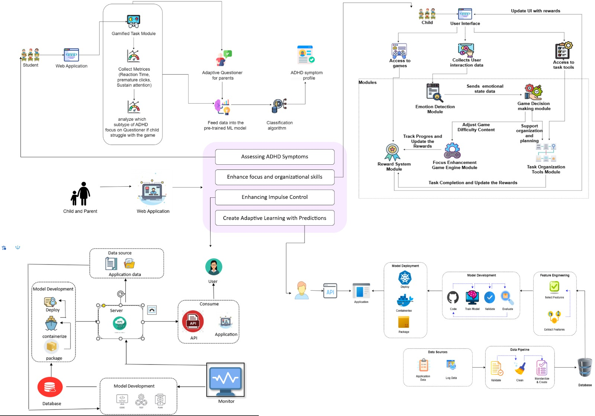

# PulseMind: 🎮🧠 AI-Driven Behavioural Assessment and Intervention for ADHD 📚

## 🔗 Overview

**PulseMind** is a cutting-edge web application designed to assist children aged 5-10 with ADHD by leveraging AI, gamification, and adaptive learning to address their unique challenges. The platform aims to identify ADHD types and deliver tailored interventions that improve focus, impulsivity, and hyperactivity management, creating a supportive and engaging learning experience.

## 👥 Team  Members

### Group Leader: IT21288326 - Dharmasena U.D.S.V. - it21288326@my.sliit.lk

### Member 1: IT21290992 - Manamperi R.S. - it21290992@my.sliit.lk

### Member 2: IT21379574 - Dilshani H.T.D.P. - it21379574@my.sliit.lk

### Member 3: IT21380532 - Halliyadda H.U.M.S. - it21380532@my.sliit.lk

## ⚠️ Problem Statement

Children aged 5-10 with ADHD face difficulties in maintaining focus, managing impulsivity, and controlling hyperactivity. Existing methods for diagnosis and intervention often lack personalization and adaptability, leaving many children underserved. A comprehensive system is needed to combine interactive technologies with AI-driven insights for better diagnosis and intervention.

## 🎯 Objectives

1. 🔍 **Identify ADHD Types**: Develop an AI-powered system integrating gamified activities and adaptive questionnaires to classify ADHD types based on DSM-5 criteria.
2. 🔄 **Enhance Focus and Organization**: Design personalized tools and structured activities to improve focus, organization, and attention span in children.
3. ⏳ **Monitor and Adapt**: Implement adaptive learning technologies for continuous monitoring and real-time feedback to caregivers and children.
4. 🔮 **Predict Future Challenges**: Utilize AI to predict potential challenges and dynamically adjust interventions for ongoing support.

---

## 🎮 Key Features

### 🔍 ADHD Type Identification
-  Gamified tasks designed to evaluate attention span, impulse control, and hyperactivity levels.
-  Real-time adjustment of questions based on behavioral performance, following DSM-5 criteria.
-  Integration of behavioral and questionnaire data to accurately classify ADHD symptoms using models like SVM and Random Forests.

### 🧰 Personalized Interventions For Inattention 
- Create tools and activities to enhance focus, organizational skills, and attention span using adaptive learning.
- Incorporate gamified elements into learning methodologies to improve motivation and engagement.
- Analyze emotional and behavioral responses to provide tailored interventions aligned with the child’s emotional state.

### 🏃🏆 Personalized Interventions For Hyperactivity-Impulsivity 
- Develop a personalized app offering structured activities like physical exercises and mindfulness techniques.
- Include five pre-designed schedules with activities tailored to different impulsive behaviors.
- Allow customization of timetables by teachers/caregivers to ensure relevance and engagement.

### ⚙️ AI-Driven Adaptive Learning
- Continuously track user interactions to provide tailored interventions.
- Generate actionable insights and progress reports for children and caregivers.
- Use AI to forecast potential challenges and dynamically adjust strategies.

---

## 💡 System Overview Diagram

---

## 📦 Dependencies

### **Frontend** 🌐
- **Framework**: React.js ⚛️
- **Styling**: bootstrap CSS
- **Libraries**:axios,phaser,react,react-dom,react-router-dom,react-scripts,web-vitals

### **Backend** 🔧
- **Framework**: Express.js 🚀
- **Libraries**:bcryptjs,cors,dotenv,express,express-session,express-validator,jsonwebtoken,mongoose,nodemailer,nodemon

### **Database** 🔐
- **Database**: MongoDB 🌱
- **Object Modeling Tool**: Mongoose

### **Flask application** 🐍
- **Framework**: Flask
- **Libraries**: Flask, Flask-CORS, joblib, NumPy

### **Machine Learning** 🧬
- **Framework**: TensorFlow
- **Libraries**: Scikit-learn, Pandas, NumPy

### **Other Tools** 🛠️
- **Image Processing**: OpenCV
- **Deployment**: Docker 🐳

---

## 📈 Deliverables
- **ADHD Identification**: Accurate classification of ADHD types.
- **Personalized Interventions**: Engaging tools to address inattention and hyperactivity challenges.
- **Reports**: Comprehensive progress reports for caregivers.
- **Scalable Framework**: Modular design for future enhancements.

---

This comprehensive AI-powered solution aims to improve diagnostic accuracy and enable effective ADHD management, ensuring better outcomes for children.
## Github repository link - https://github.com/IT21288326/adhd-assessment-system

